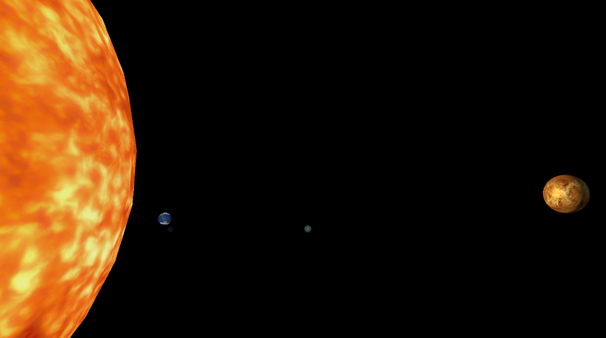
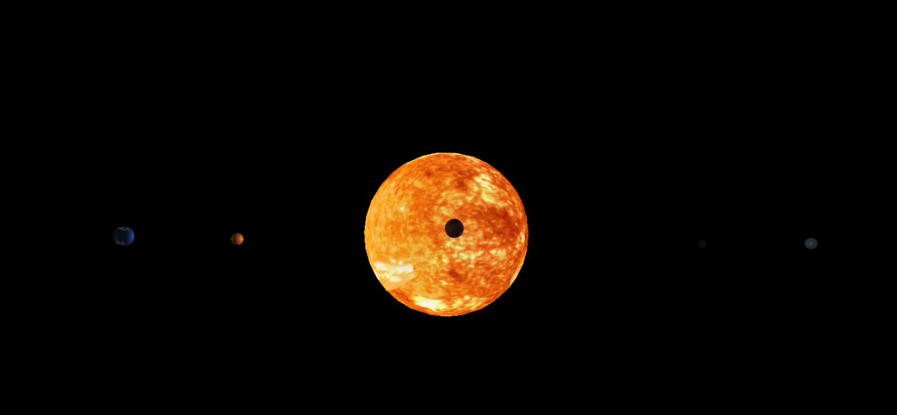

3D Project using Pythong and OpenGL as a personal project for learning graphics computing.

The Engine is using OpenGL libraries and a basic Phong light model inside the lit shader.

Engine developed during the course of 5 days as a Graphics Engine training.

## Examples

For more projects and info: https://alejandrovegadev.wixsite.com/alejandro-vega 